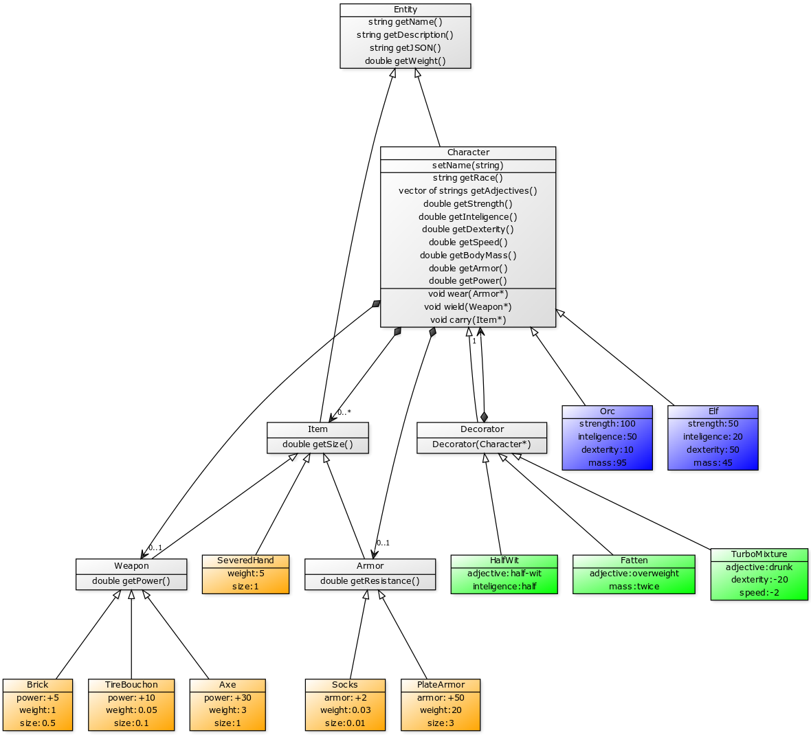

# A Generic Role Playing Game (pun intended)

## Task
### English
Implement class structure described below on a diagram [UML diagram](https://en.wikipedia.org/wiki/Unified_Modeling_Language).
Add all files in the `Entities` directory separating classes into `.h` and `.cpp` files.
Include all relevant headers in the `Entities/Entities.h` file.

### Polski
Zaimplementuj strukturę klas przedstawioną na schemacie poniżej [UML diagram](https://pl.wikipedia.org/wiki/Unified_Modeling_Language).
Dodaj wszystkie pliki w katalogu `Entities`, dzieląc klasy na pliki `.h` i `.cpp`.
Załącz wszystkie potrzebne pliki nagłówkowe w `Entities/Entities.h`.

## Rulebook


### Clarifications:
The weight of the character is the sum of its body mass and all equipment he carries.
Character can carry any number of items that fit in a sack of size `10`.
Character can wield only one weapon, and wear only one armor.
Character's speed is equal to it's strength divided by his total weight.

## Requirements

Only files in the `Entities` directory will be considered as solution.
Everything have to be properly **destroyed**, this means [virtual destructor](https://www.geeksforgeeks.org/virtual-destructor/).

### Description:
The `getDescription` function should return a string that (as the name suggest) describe the item/character, and should include (for a character):
- Name (if present)
- Decorators
- Race
- Weapon (if any)
- Armor (if any)
- other Items (if any)

for instance:
`John the half-wit orc, wielding a brick, wearing a plate armor, and carrying some socks and a severed hand`

### Usage:
```c++
Character * orc = new Ord();
// an orc
orc->wield(new Brick());
// an orc, wielding a brick
orc->carry(new Socks());
// an orc, wielding a brick, and carrying some socks
orc = new HalfWit(orc);
// a half-wit orc, wielding a brick, and carrying some socks
orc->setName("John");
// John the half-wit orc, wielding a brick, and carrying some socks
orc->wear(new PlateArmor());
// John the half-wit orc, wielding a brick, wearing a plate armor, and carrying some socks
orc->carry(new Socks());
// John the half-wit orc, wielding a brick, wearing a plate armor, and carrying some socks and a severed hand
orc->getSpeed();
// (100)/(95+0.5+20+0.03+5) = 0.82966896208
orc->getArmor();
// 50
orc->getPower();
// 5
```

### JSON
The `getJSON` function should return a computer-readable data about the item/character in the [JSON format](https://en.wikipedia.org/wiki/JSON). For example (for the same character as above):
```json
{
	"type": "Character",
	"name": "John",
	"race": "orc",
	"adjectives": [ "half-wit" ],
	"wield": {
		"type": "Weapon",
		"name": "brick",
		"power": 5,
		"weight": 1,
		"size": 0.5
	},
	"wear": {
		"type": "Armor",
		"name": "plate armor",
		"armor": 50,
		"weight": 20,
		"size": 3
	},
	"carry": [
		{
			"type": "Armor",
			"name": "socks",
			"armor": 2,
			"weight": 0.03,
			"size": 0.01
		},
		{
			"type": "Item",
			"name": "severed hand",
			"weight": 5,
			"size": 1
		}
	]
}
```
**The JSON string doesn't have to be formated the same way! But it have to be a valid JSON.**

### Requirements

Only files in the `Entities` directory will be considered as solution.

## Acknowledgments

Idea by [G. Gruszczynski](https://github.com/ggruszczynski). UML diagram done with [`yuml.me`](https://yuml.me/).
