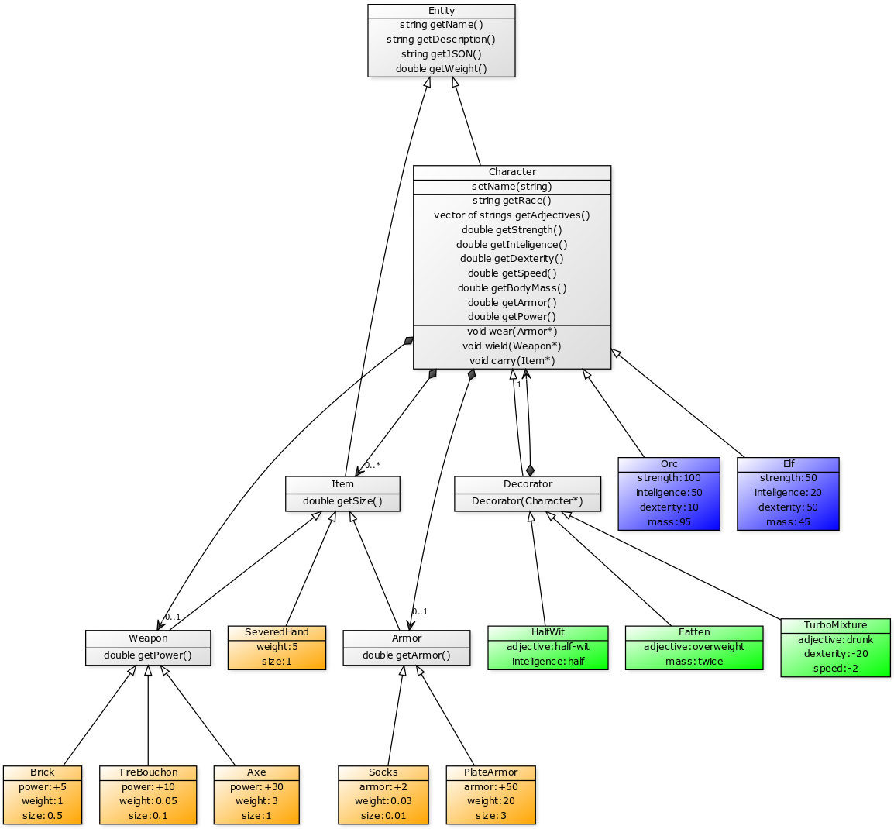

# A Generic Role Playing Game (pun intended)

## Task
### English
Implement class structure described below on a diagram [UML diagram](https://en.wikipedia.org/wiki/Unified_Modeling_Language).
Add all files in the `Entities` directory separating classes into `.h` and `.cpp` files.
Include all relevant headers in the `Entities/Entities.h` file.

### Polski
Zaimplementuj strukturę klas przedstawioną na schemacie poniżej [UML diagram](https://pl.wikipedia.org/wiki/Unified_Modeling_Language).
Dodaj wszystkie pliki w katalogu `Entities`, dzieląc klasy na pliki `.h` i `.cpp`.
Załącz wszystkie potrzebne pliki nagłówkowe w `Entities/Entities.h`.

## Rulebook

### Clarifications:
The weight of the character is the sum of its body mass and all equipment he carries.
Character can carry any number of items that fit in a sack of size `100`.
Character can wield only one weapon, and wear only one armor.
Character's speed is equal to it's strength divided by his total weight.

## Requirements

Only files in the `Entities` directory will be considered as solution.

## Acknowledgments

Idea by [G. Gruszczynski](https://github.com/ggruszczynski). UML diagram done with [`yuml.me`](https://yuml.me/).